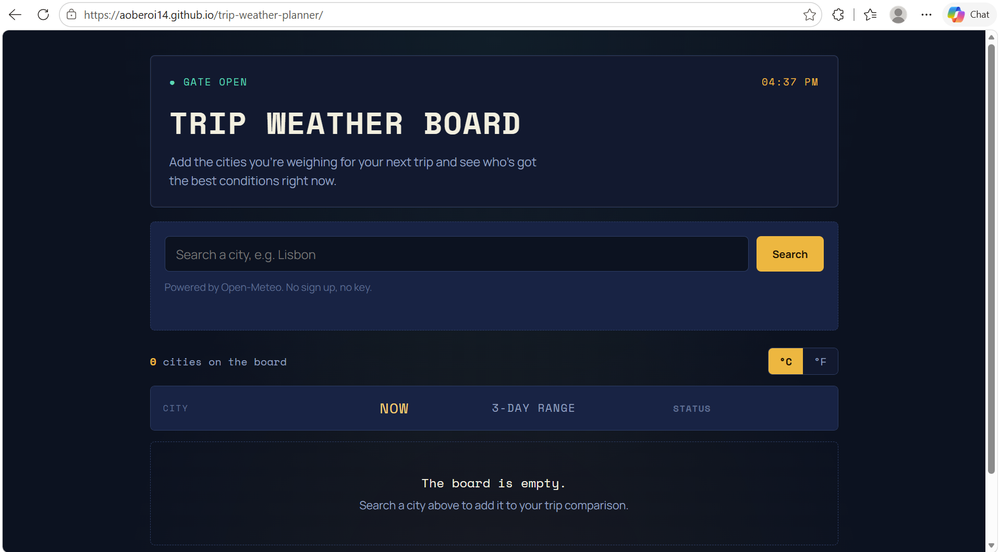

# Trip Weather Board

A weather comparison tool styled like an airport departure board. Search any city, add it to the board, and compare current conditions and a 3 day outlook against every other city you're considering for your next trip.

## What it does

- Search a city by name and pick the right match from the results (handles cities with the same name in different countries)
- Add up to 8 cities to the board at once
- See current temperature, a 3 day high/low range, and a status tag (ON TIME, BOARDING, DELAYED) based on how clear or rough the weather is
- Click any city row for a detail view with a day by day breakdown and a "best day to land" callout
- Switch between Celsius and Fahrenheit
- Your board is saved in localStorage, so your cities are still there next time you open the site
- Handles loading and error states per city, including a retry button if a forecast fails to load

## API used

[Open-Meteo](https://open-meteo.com), specifically:
- the [Geocoding API](https://open-meteo.com/en/docs/geocoding-api) to turn a city name into coordinates
- the [Forecast API](https://open-meteo.com/en/docs) for current weather and the 3 day daily forecast

No API key required.

## Live site

https://aoberoi14.github.io/trip-weather-planner/

## Screenshot



## How to Run Locally

This is plain HTML, CSS, and JavaScript, no build step and no dependencies to install.

1. Clone the repo:
```
git clone https://github.com/aoberoi14/trip-weather-planner.git
cd trip-weather-planner
```
2. Open `index.html` directly in a browser, or run a local static server:
```
python3 -m http.server 8000
```
3. Then visit:
```
http://localhost:8000/
```

## Tech

Vanilla HTML, CSS, and JavaScript. No build step, no framework, deployed directly on GitHub Pages.

## Project docs

- [PROPOSAL.md](./PROPOSAL.md)
